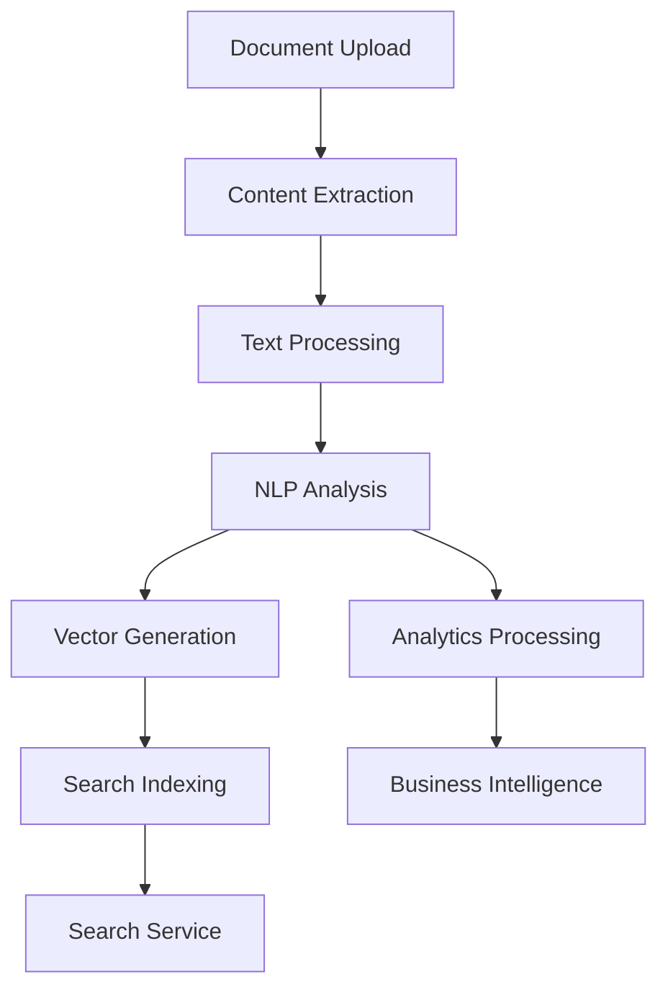
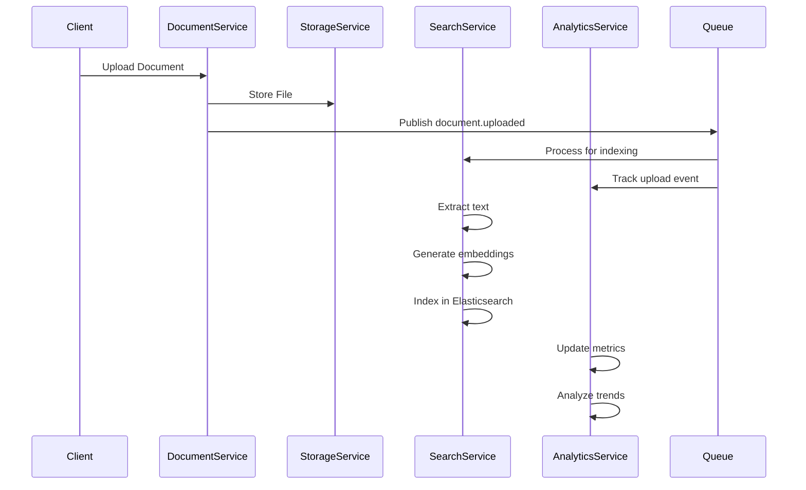
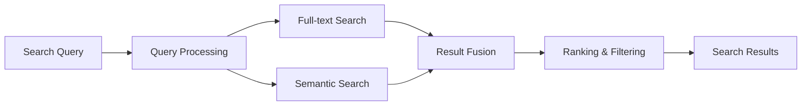
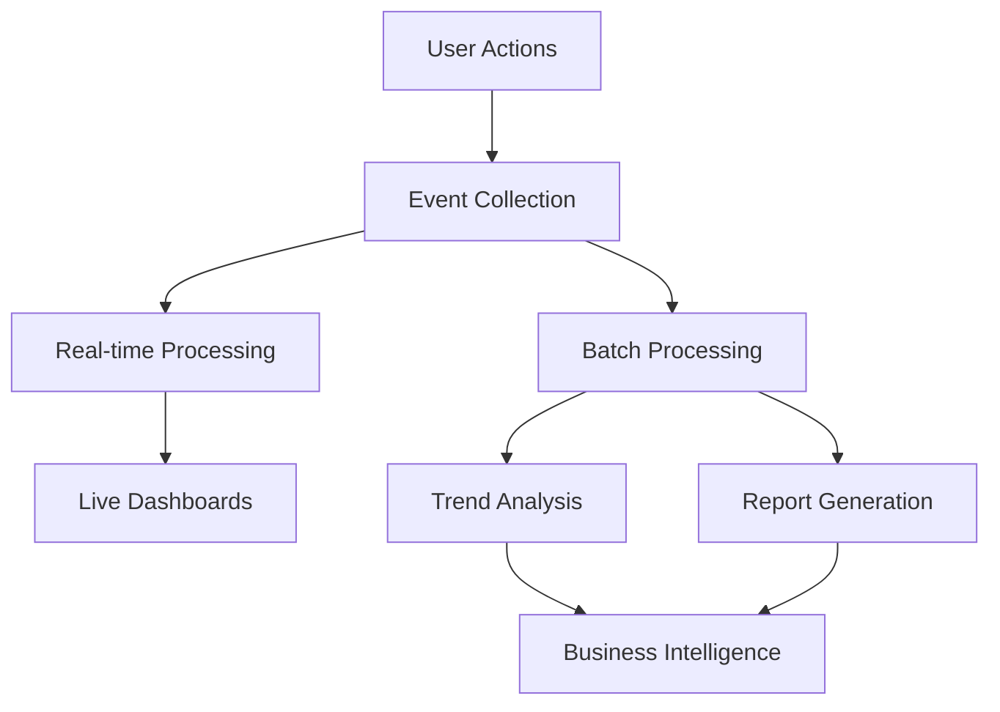
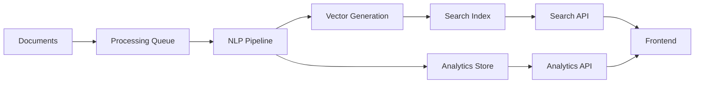

# Semantic Search and Analytics Pipeline

## Overview

RedZ combines traditional full-text search with AI-powered semantic understanding to provide intelligent document discovery and content insights. The system processes documents through multiple stages to extract meaning and enable advanced analytics.

## Pipeline Architecture

## Content Processing Flow

## Document Processing Stages

### Stage 1: Content Extraction
- **PDF Processing**: Text extraction using libraries like pdf-parse or pdfjs
- **Image Processing**: OCR using Tesseract.js for text extraction
- **Notion Documents**: Rich text parsing and structure preservation
- **Text Cleaning**: Normalization and preprocessing

### Stage 2: NLP Analysis
- **Language Detection**: Identify document language
- **Sentiment Analysis**: Overall document sentiment scoring
- **Named Entity Recognition**: Extract people, organizations, locations
- **Topic Classification**: Categorize content by subject matter
- **Keyword Extraction**: Identify important terms and phrases

### Stage 3: Semantic Processing
- **Text Chunking**: Split documents into meaningful segments
- **Embedding Generation**: Create vector representations using models like:
  - Sentence Transformers
  - OpenAI embeddings
  - Local models (all-MiniLM-L6-v2)
- **Vector Storage**: Store embeddings in Elasticsearch or MongoDB

## Search Implementation

### Search Types

#### Full-text Search
- Elasticsearch-based keyword matching
- Support for complex queries and filters
- Faceted search capabilities
- Highlighting and suggestions

#### Semantic Search
- Vector similarity matching
- Query embedding generation
- Cosine similarity scoring
- Contextual understanding

#### Hybrid Search
- Combines full-text and semantic results
- Weighted scoring algorithms
- Re-ranking based on relevance
- Multi-modal search capabilities

## Analytics Pipeline

### Analytics Components

#### Real-time Analytics
- Document view tracking
- Search query monitoring
- User engagement metrics
- System performance metrics

#### Trend Analysis
- **Topic Evolution**: How content themes change over time
- **Sentiment Trends**: Emotional tone analysis across documents
- **Usage Patterns**: User behavior and engagement trends
- **Content Growth**: Document volume and type trends

#### Business Intelligence
- Executive dashboards with key metrics
- Content performance analytics
- User adoption and retention insights
- Search effectiveness measurements

## Technology Stack

### NLP and AI
- **Text Processing**: Natural language processing libraries
- **Embeddings**: Vector generation models
- **Sentiment Analysis**: Pre-trained sentiment models
- **Entity Recognition**: Named entity extraction tools

### Search Infrastructure
- **Elasticsearch**: Primary search engine
- **Vector Databases**: Embedding storage and retrieval
- **Caching**: Redis for search result caching
- **Indexing**: Real-time and batch indexing pipelines

### Analytics Infrastructure
- **Event Streaming**: RabbitMQ for real-time events
- **Data Processing**: Background job processing
- **Metrics Storage**: Time-series data in databases
- **Visualization**: Dashboard and reporting tools

## Data Flow

## Performance Considerations

### Caching Strategy
- Search result caching in Redis
- Embedding vector caching
- Metadata caching for fast access
- CDN for static content delivery

### Scalability Approach
- Horizontal scaling of processing workers
- Elasticsearch cluster for search scaling
- Background job queuing for heavy operations
- Database optimization with proper indexing

### Optimization Techniques
- Incremental indexing for new documents
- Batch processing for bulk operations
- Compression for vector storage
- Query optimization and result pagination

This pipeline architecture provides RedZ with advanced semantic understanding while maintaining simplicity and performance.